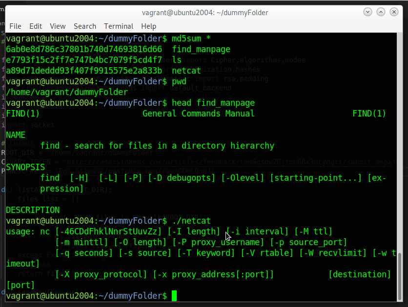
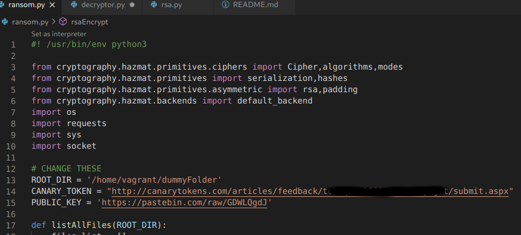
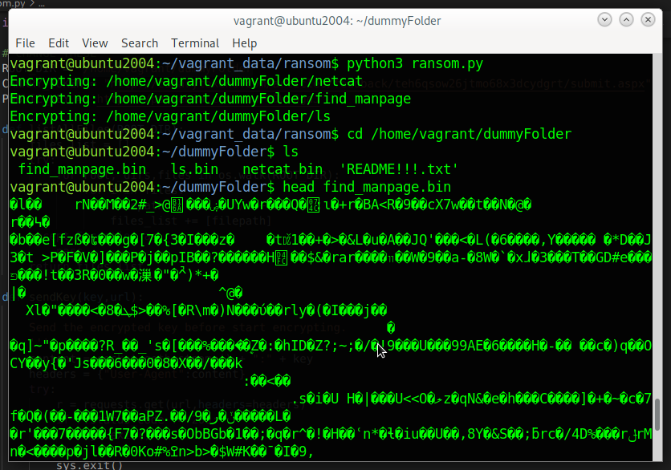
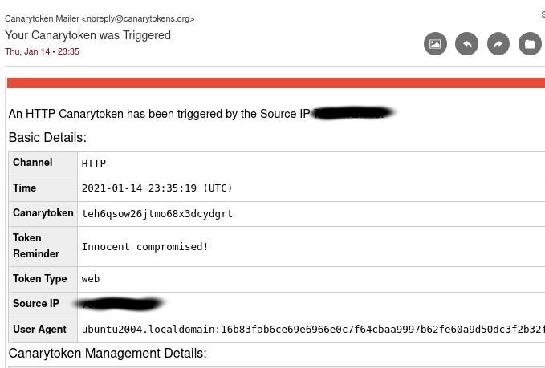
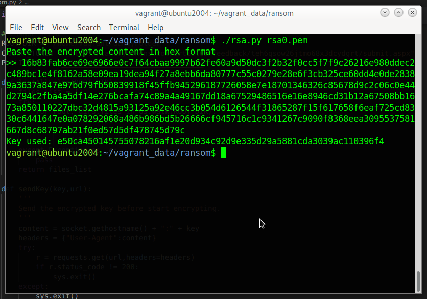
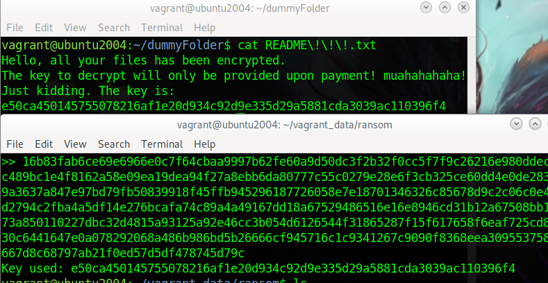
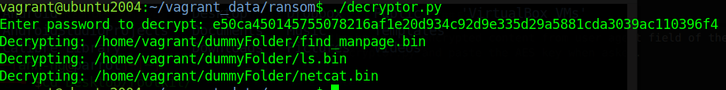
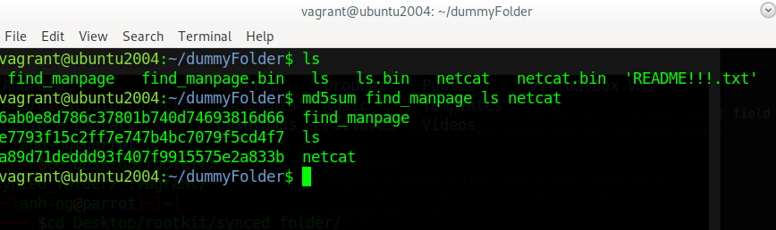

# POC PYTHON RANSOMWARE
### Disclaimer:
> This is my personal project for testing and educational purposes only.
> Use at your own risk, I take no reposibility for any damage that may be done by the usage of these scripts. 
> DON'T RUN IT ON YOUR PERSONAL COMPUTER. It is recommended to try it out in a sandbox/virtualized environment.
### What do the scripts do
Here is a summary of what each script is supposed to do.
ransom.py :
- Attempt to retrieve the uploaded publick key from pastebin.com
- Generate a random AES key
- Encrypt the AES key with the public key
- Send the encrypted key and the hostname to the attacker by activate the canary token
- Start walking down from the root directory and encrypting any files it can
- Leave a ransom note 

rsa.py 
- Generate rsa key pairs if argument "-g" is used
- Decrypt the content receive via canary token to retrieve the generated AES key 

decryptor.py 
- 

# To infect a target
1. Generate RSA key pair with
```
python3 rsa.py -g key
```
2. Upload content of the public key to pastebin.com
3. Setup an URL canary token that would notify you when the URL is visited. 
4. Modify ransom.py script with the URLs  from step 2 and 3
5. Specify the root directory. Any files in the root directory and its sub directory will be encrypted.
6. Execute ransom.py and see it wreak havoc :)
# To decrypt
1. Retrieve the AES key:
```
python3 rsa.py key_private.pem
```
Paste the hexlified encrypted content from user agent field of the email from canary token
2. Run decryptor.py and paste the AES key when asked.

## Example
Prepare a dummy folder with a few random files

Prepare the script 

Fire at the target folder

Canarytoken alert with the hostname and encrypted AES key 

Decrypt and retrieve the AES key using RSA private key

The ransom note also contain the AES key, it's the proof that the decryption process was indeed sucessful

Run decryptor.py to recover the original files

Original files are recovered. Their md5 hashes are exactly the same as before they were encrypted
